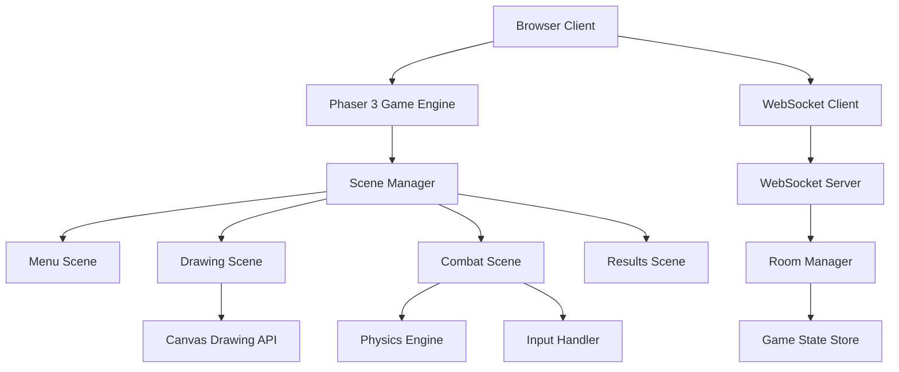

# Design Document

## Overview

Scribble Royale is a browser-based multiplayer fighting game built with Phaser 3 that allows players to draw custom fighters and battle in real-time. The architecture consists of a client-side Phaser application handling game rendering and input, paired with a WebSocket-based multiplayer system for real-time synchronization between players.

The game follows a clear flow: Room Creation/Joining → Drawing Phase → Combat Phase → Results → Repeat. Each phase is managed by Phaser scenes, with state synchronization handled through WebSocket connections.

## Architecture

### High-Level Architecture



### Client Architecture

- **Phaser 3 Framework**: Core game engine handling rendering, physics, and asset management
- **Scene System**: Modular scenes for different game phases (Menu, Drawing, Combat, Results)
- **WebSocket Client**: Real-time communication with server for multiplayer functionality
- **Canvas Integration**: HTML5 Canvas API for drawing functionality, converted to Phaser textures
- **Input System**: Keyboard input handling for fighter control during combat

### Server Architecture

- **WebSocket Server**: Node.js-based server handling real-time connections
- **Room Management**: System for creating, joining, and managing game rooms
- **State Synchronization**: Broadcasting game state changes to connected clients
- **Session Management**: Handling player connections, disconnections, and room cleanup

## Components and Interfaces

### Core Game Components

#### GameManager
- Manages overall game state and scene transitions
- Handles WebSocket connection lifecycle
- Coordinates between different game phases

```typescript
interface GameManager {
  currentScene: string;
  socket: WebSocket;
  roomCode: string;
  playerId: string;
  
  joinRoom(code: string): Promise<boolean>;
  createRoom(): Promise<string>;
  switchScene(sceneName: string): void;
  sendGameEvent(event: GameEvent): void;
}
```

#### DrawingCanvas
- Integrates HTML5 Canvas with Phaser for drawing functionality
- Converts drawings to transparent PNG format for use as game sprites
- Provides drawing tools and controls
- Maintains transparent background for proper sprite rendering in combat

```typescript
interface DrawingCanvas {
  canvas: HTMLCanvasElement;
  context: CanvasRenderingContext2D;
  isDrawing: boolean;
  
  startDrawing(x: number, y: number): void;
  draw(x: number, y: number): void;
  stopDrawing(): void;
  exportToPNG(): string; // Base64 encoded transparent PNG
  clear(): void;
  initializeTransparentCanvas(): void;
}
```

#### Fighter
- Represents a player's drawn character in combat
- Handles physics, movement, and combat mechanics
- Manages health and animation states

```typescript
interface Fighter {
  sprite: Phaser.GameObjects.Sprite;
  health: number;
  maxHealth: number;
  velocity: { x: number, y: number };
  isAttacking: boolean;
  
  move(direction: number): void;
  jump(): void;
  attack(): void;
  takeDamage(amount: number): void;
  updateHealthBar(): void;
}
```

#### RoomManager (Server-side)
- Manages multiplayer rooms and player connections
- Handles room creation, joining, and cleanup
- Synchronizes game state between players

```typescript
interface RoomManager {
  rooms: Map<string, Room>;
  
  createRoom(): string;
  joinRoom(roomCode: string, playerId: string): boolean;
  leaveRoom(roomCode: string, playerId: string): void;
  broadcastToRoom(roomCode: string, event: GameEvent): void;
}
```

### Scene Structure

#### MenuScene
- Room creation and joining interface
- Connection status display
- Navigation to drawing phase once room is ready

#### DrawingScene
- Transparent canvas drawing interface
- Drawing tools and controls
- Transparent PNG export and submission to other players
- Waiting for opponent to finish drawing

#### CombatScene
- Real-time fighter combat
- Physics simulation and collision detection
- Health bar display and damage calculation
- Input handling for movement and attacks

#### ResultsScene
- Win/lose display
- Option to play again or return to menu
- Statistics display (optional)

## Data Models

### Game State
```typescript
interface GameState {
  phase: 'menu' | 'drawing' | 'combat' | 'results';
  roomCode: string;
  players: {
    [playerId: string]: {
      id: string;
      ready: boolean;
      fighterImage?: string; // Base64 PNG
      health: number;
      position: { x: number, y: number };
    }
  };
  winner?: string;
}
```

### Game Events
```typescript
interface GameEvent {
  type: 'join_room' | 'player_ready' | 'fighter_submit' | 'move' | 'attack' | 'damage' | 'game_over';
  playerId: string;
  data: any;
  timestamp: number;
}
```

### Room Data
```typescript
interface Room {
  code: string;
  players: Set<string>;
  gameState: GameState;
  createdAt: Date;
  lastActivity: Date;
}
```

## Error Handling

### Client-Side Error Handling
- **Connection Errors**: Automatic reconnection attempts with exponential backoff
- **Drawing Errors**: Canvas state recovery and user feedback for drawing issues
- **Asset Loading**: Fallback sprites and error messages for failed transparent PNG loads
- **Input Validation**: Sanitization of user inputs and drawing data
- **Canvas Transparency**: Proper handling of transparent background preservation during drawing operations

### Server-Side Error Handling
- **Room Management**: Cleanup of abandoned rooms and handling of invalid room codes
- **WebSocket Errors**: Graceful handling of connection drops and message parsing errors
- **State Synchronization**: Conflict resolution for simultaneous game events
- **Memory Management**: Automatic cleanup of inactive rooms and player sessions

### Error Recovery Strategies
- **Graceful Degradation**: Continue gameplay with reduced functionality if non-critical systems fail
- **State Recovery**: Ability to restore game state from last known good state
- **User Feedback**: Clear error messages and recovery instructions for players

## Testing Strategy

### Unit Testing
- **Component Testing**: Individual testing of Fighter, DrawingCanvas, and GameManager classes
- **Scene Testing**: Isolated testing of each Phaser scene's functionality
- **Utility Testing**: Testing of helper functions for PNG conversion, input handling, etc.

### Integration Testing
- **Client-Server Communication**: Testing WebSocket message flow and state synchronization
- **Scene Transitions**: Testing smooth transitions between different game phases
- **Drawing to Combat Flow**: End-to-end testing of drawing submission and fighter creation

### Performance Testing
- **Frame Rate Testing**: Ensuring consistent 60fps during combat with custom PNG sprites
- **Memory Usage**: Testing for memory leaks during multiple game sessions
- **Network Performance**: Testing WebSocket performance under various connection conditions

### Browser Compatibility Testing
- **Cross-Browser Testing**: Ensuring compatibility across Chrome, Firefox, Safari, and Edge
- **Canvas API Testing**: Verifying drawing functionality across different browsers
- **WebSocket Testing**: Testing real-time communication reliability across browsers

### User Experience Testing
- **Drawing Interface**: Testing drawing tools responsiveness and PNG quality
- **Combat Feel**: Testing fighter movement, attack timing, and collision detection
- **Multiplayer Flow**: Testing room creation, joining, and player synchronization